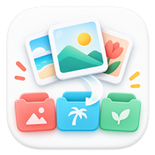

# PhotoBuddy

<p align="center">
  
</p>

[](https://developer.android.com/)
[](https://kotlinlang.org/)
[](https://github.com/whjwjx/PhotoBuddy/releases)

PhotoBuddy is an offline-first Android app for cleaning up photos and videos with a low-pressure, swipe-based review flow.

像刷短视频一样一张张整理本地照片和视频：保留、收藏、稍后处理、加入待删除复核，真正删除前始终交给 Android 系统确认。

[Download APK](https://github.com/whjwjx/PhotoBuddy/releases) · [Features](#features) · [Build from Source](#build-from-source) · [Privacy & Safety](#privacy--safety)

## Why

Phone galleries grow quietly: screenshots, duplicate shots, large videos, saved images, and old memories all end up in the same place. Traditional gallery apps are good at browsing, but not always good at helping you make small cleanup decisions every day.

PhotoBuddy turns cleanup into a simple loop:

1. Look at one photo or video.
2. Make one small decision.
3. Move on.
4. Review before anything is deleted.

The goal is not automatic deletion. The goal is a calmer way to make progress.

## Features

- Swipe through local photos and videos one item at a time.
- Mark media as keep, favorite, later, or pending delete.
- Review pending deletes before calling Android system confirmation.
- Organize media into local in-app albums without moving or renaming files by default.
- Jump into short queues: screenshots, large videos, recent media, monthly review, today in history, favorites, and later.
- Compare similar-photo candidates and keep the better shot.
- Track cleanup progress, estimated releasable space, and daily activity.
- Store state locally with Room and DataStore.

## Privacy & Safety

- Local-first: photos and videos stay on your device.
- No account, no server, no cloud upload.
- Swipe-up only marks media as pending delete.
- Final deletion requires review and Android system confirmation.
- App albums are local mappings by default; PhotoBuddy does not move, rename, or create system album files unless a future feature explicitly says so.
- Android partial photo access is supported, but choosing full media access gives the app a complete gallery view.

## Install

Download the latest APK from [Releases](https://github.com/whjwjx/PhotoBuddy/releases). Release assets also include `SHA256SUMS.txt` for basic file verification.

Requirements:

- Android 8.0 or later
- Photo/video media permission
- "Install unknown apps" enabled for your browser or file manager when installing from GitHub

For the first public preview, it is best to try PhotoBuddy on a backed-up device or test gallery before using it with irreplaceable media.

## Screenshots

The app icon is shown above for now. Real app screenshots and a short demo GIF are planned for the next documentation pass.

## Build from Source

Requirements:

- Android Studio, recent stable version
- JDK 17+
- Android SDK Platform 37
- Gradle wrapper included in this repository

Build a debug APK:

```bash
./gradlew assembleDebug
```

On Windows:

```powershell
.\gradlew.bat assembleDebug
```

The debug APK will be generated under:

```text
app/build/outputs/apk/debug/
```

## Tech Stack

- Kotlin
- Jetpack Compose + Material 3
- Room
- DataStore
- MediaStore
- WorkManager
- Coil
- Media3 ExoPlayer

## Roadmap

| Area | Status |
|---|---|
| Local photo/video cleanup | Available |
| Pending-delete review flow | Available |
| Local albums | Available |
| Similar-photo comparison | Available |
| Daily reminders and streaks | Planned |
| Better large-library paging | Planned |
| AI-assisted grouping and quality signals | Later |
| Private in-app media library mode | Later |
| Audio and broader file cleanup | Exploratory |

## Project Status

PhotoBuddy is an early open-source preview. The app is already usable for local photo/video cleanup, but the public packaging, screenshots, documentation, and release workflow are still being polished.

## License

Licensed under the Apache License, Version 2.0. See [LICENSE](LICENSE) for details.
